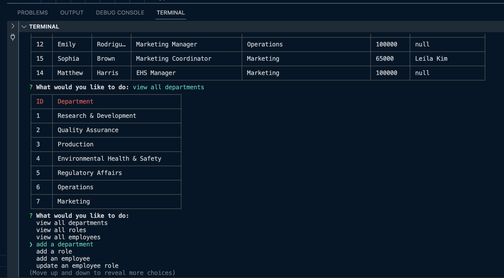

# rafa-employee-tracker

## Description

The goal of this project is to create a database using MySQL to track the employees of a company. The database is accessed using inquirer prompts in the console. When the users run the program in the console, a list of options is displayed. Users are able to view all departments, view all roles, view all employees, add a department, add a role, add an employee, and update an employee role.

## Installation

run "npm i" in the console to install the required packages.

## Usage

This is an employee tracker program, which allows users to select an option from a list. Users are able to view and update infromation on tables containing employee information.

## Screenshot of application

## Credits

N/A

## License

This project uses the MIT license.

## Badges

## Features

- View a formatted table showing department names and department ids.
- Presents a table containing the job title, role id, the department that role belongs to, and the salary for that role.
- Presents with a formatted table showing employee data, including employee ids, first names, last names, job titles, departments, salaries, and managers that the employees report to
- Add a department to the database.
- Add a new role to the database including its name, salary, and department it belongs to.
- Add a new employee’s first name, last name, role, and manager to the database.
- Update an employee's role in the databse.
